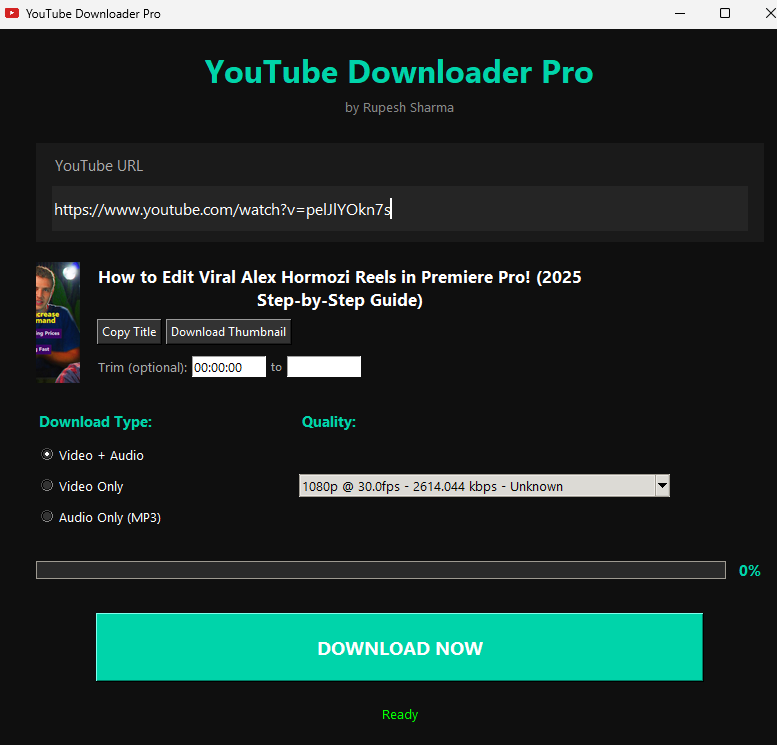
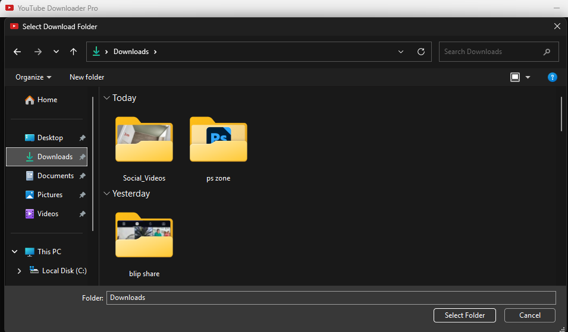
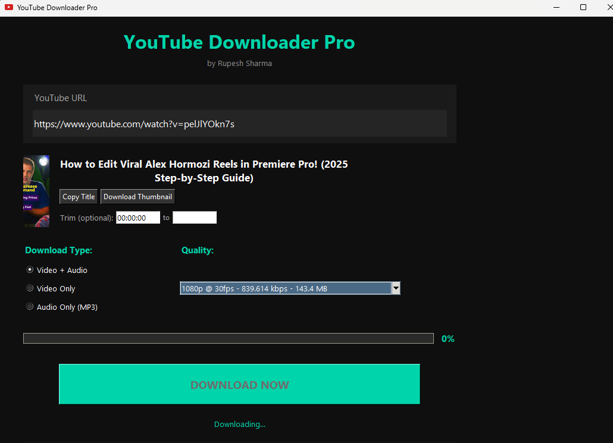
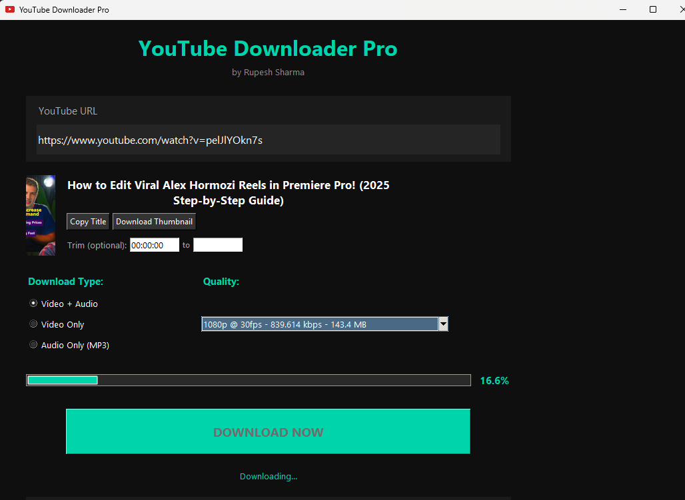
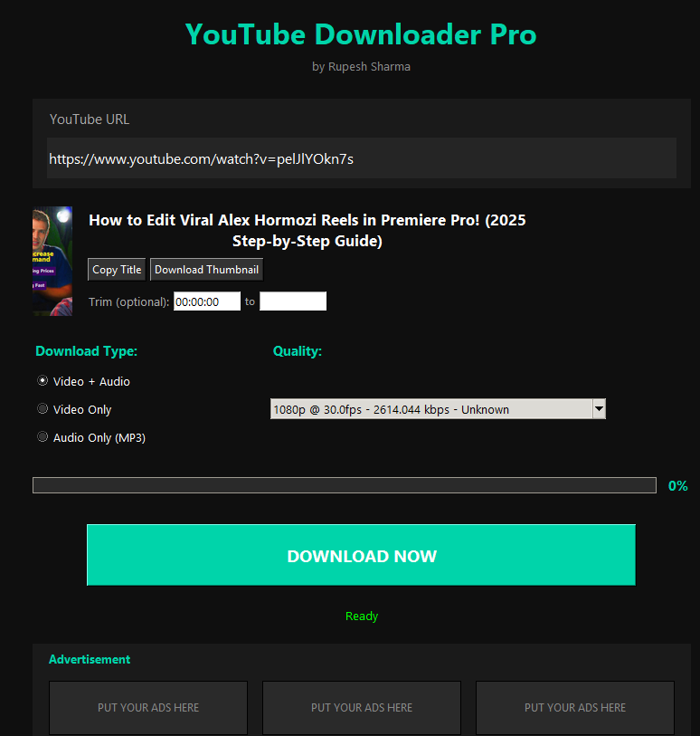

# YouTube Downloader Pro v0.0.2

**Download YouTube videos in HD, trim clips, extract MP3, and auto-save thumbnails — all in one click!**  
**No ads. No bloat. 100% Free.**

[Download YouTube Downloader Pro v0.0.2 (.exe)](https://github.com/Rupesh9369/ytdownloaderpro/raw/refs/heads/main/YouTube%20Downloader%20Pro.exe)
---

## Screenshots

| | | |
|:--:|:--:|:--:|
|  |  |  |
|  |  |  |
|  |  |  |

---

## Features

- **Auto-load** when you paste a YouTube link  
- **Live progress bar** (1% → 100%)  
- **Show video quality with FPS & bitrate**  
  - `1080p @ 60fps - 4500 kbps`  
- **Trim any part** of the video  
  - `From: 00:01:30` → `To: 00:02:10`  
- **Download MP3** (best quality)  
- **Auto-download thumbnail** (PNG)  
- **Video + Audio merged** perfectly  
- **No playlist support** (single video only)  
- **No console window** – clean GUI  
- **Auto-installs ffmpeg & yt-dlp** (first run)  
- **Works offline after setup**

---

## How to Use

1. **Download** the `.exe` from the button above  
2. **Double-click** to run (no install needed)  
3. **Paste** any YouTube link  
4. Choose **quality**, **type**, and **trim** (optional)  
5. Click **DOWNLOAD NOW**  
6. Done! Files saved to your folder

---

## Download

---

## Made With

- Python + Tkinter  
- `yt-dlp` + `ffmpeg`  
- PyInstaller (single .exe)

---

**By [Rupesh Sharma](https://github.com/Rupesh9369)**  
**Star the repo if you like it!**